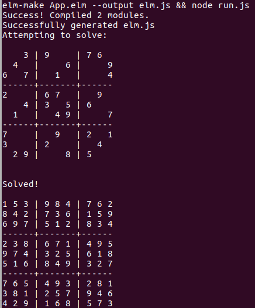

# elm-sudoku

Yet another Sudoku solver in Elm.

## Html version

Try the HTML version here: https://natim.github.io/elm-sudoku/

You can run it locally with ``make live``

## CLI version

You can use ``make start`` to run the solver in a terminal.

## Inspirational

This sudoku solver has been inspired by a project I did in C++ back in
the days: [sudoku](https://github.com/Natim/sudoku) as well as
[zwilias sudoku-solver](https://github.com/zwilias/sudoku-solver)